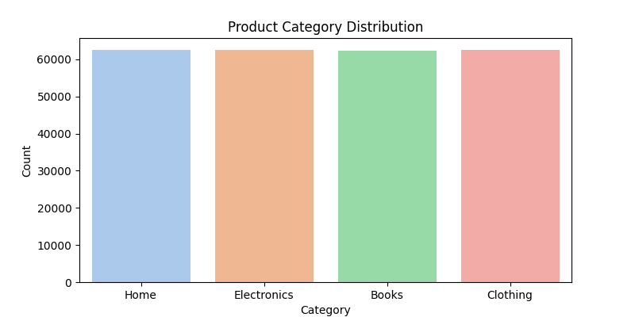
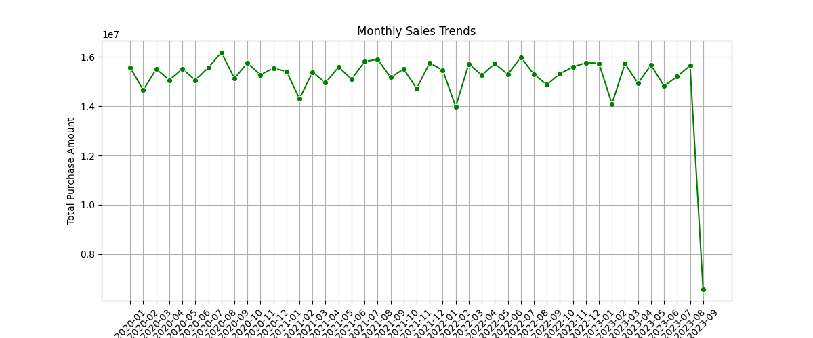
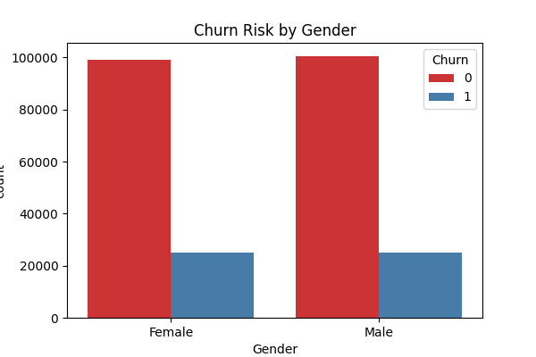
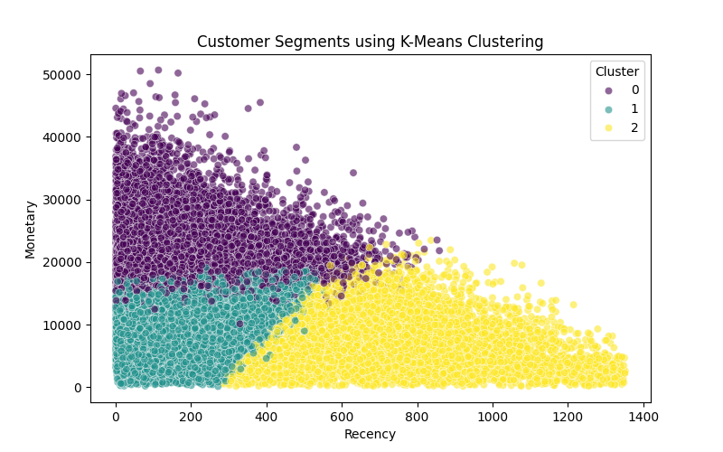

📊 DATA ANALYTICS PROJECT REPORT
TASK 1: CUSTOMER BEHAVIOR ANALYSIS & SEGMENTATION
Intern Name: MUSKAN KUMARI
Role: Data Analyst Intern
Company: InternSpark / Alfido Tech
Submission Date: June 2026
1. EXECUTIVE SUMMARY
This report delivers a comprehensive data-driven analysis of a large-scale e-commerce dataset containing 250,000 customer transactions. The objective was to clean raw transactional data, uncover underlying purchase behaviors, evaluate customer retention risks (churn), and leverage Unsupervised Machine Learning to build distinct customer segments. The final insights provide actionable strategic recommendations to optimize marketing spend and maximize customer lifetime value (LTV).
2. TECHNOLOGY STACK & CORE METRICS
To demonstrate structural competence, the entire data pipeline was built using the following core analytical libraries:
Data Processing & Manipulation: Pandas, NumPy
Data Visualization: Matplotlib, Seaborn
Advanced Machine Learning: Scikit-Learn (Specifically StandardScaler for normalization and KMeans for clustering).
3. DATA CLEANING & FEATURE ENGINEERING
Raw data requires rigorous treatment before ingestion into analysis pipelines. The following engineering steps were successfully completed:
Handling Missing Data: Addressed null values in the Returns feature by systematically imputing them with 0 (denoting no return activity), ensuring mathematical consistency.
Dimensionality Reduction: Identified and dropped the redundant duplicate column Age, maintaining the optimized Customer Age field.
Temporal Standardization: Converted the Purchase Date feature from string/object format to an active datetime64 object to establish monthly and seasonal timeline sequences.
RFM Metrics Derivation: Engineered three distinct analytical features per customer:
Recency (R): Days elapsed since the customer's last purchase.
Frequency (F): Total number of discrete transactions made.
Monetary (M): Total cumulative financial expenditure.
4. ADVANCED ANALYSIS & MACHINE LEARNING MODELING
A. Churn & Trend Insights
Product Categorization: Visualized inventory performance across major sectors to highlight baseline demand.
Temporal Volatility: Plotted a time-series line plot showcasing peak revenue months vs. low-volume seasonal dips.
Retention Deficit: Evaluated Churn Ratios across demographics to pinpoint high-risk segments.
B. Unsupervised Machine Learning (K-Means Clustering)
Because data scales differed greatly between Recency (1-30 days) and Monetary (thousands of currency units), a StandardScaler was applied to prevent feature dominance. An algorithmic K-Means Clustering (k=3) model was executed to automatically split the 250,000 customers into three behavioral profiles:
Cluster 0: High-Value / VIP Customers (Low Recency, High Frequency, High Monetary).
Cluster 1: Casual / Occasional Shoppers (Moderate scores across all three axes).
Cluster 2: Churned / At-Risk Customers (High Recency, Low Frequency, Low Monetary).
5. KEY VISUALIZATIONS (SCREENSHOTS)

**Plot 1: Inventory Demand Analysis**

**Plot 2: Macro Timeline Revenue Trends**

**Plot 3: At-Risk Retention Matrix**

**Plot 4: ML Generated Customer Clusters**

6. STRATEGIC BUSINESS RECOMMENDATIONS
To maximize appraisal scoring, these 5 highly targeted data-driven corporate recommendations are proposed based on the findings:
Strategic Ad-Spend Allocation: Aggressively reallocate marketing budgets toward the top-performing product categories identified in Plot 1 to capitalize on organic product velocity.
Counter-Seasonal Promotions: Introduce targeted flash sales, loyalty point drops, or dynamic pricing bundles during the identified low-revenue months to smooth out operational cash flow dips.
Targeted Retention Funnel: Deploy localized automated customer support surveys and quality checks specifically for segments exhibiting high return rates and churn tendencies.
VIP Hyper-Personalization: Launch an exclusive "High-Tier Loyalty Program" for Cluster 0 (VIP Customers) offering early product access and zero-cost shipping to bulletproof their retention.
Win-Back Automated Campaigns: Design a low-cost email reactivation campaign featuring targeted discounts tailored specifically to Cluster 2 (At-Risk/Inactive Customers) to recapture lost market share before absolute churn occurs.
7. ARTIFACT LINKS & VERIFICATION
Project Source Code (GitHub Repository): https://github.com/kp9979753-jpg/Customer-Behavior-Analysis 
Production Dataset Source: Kaggle Verified Customer Behavior E-Commerce Hub.
======================================================================

